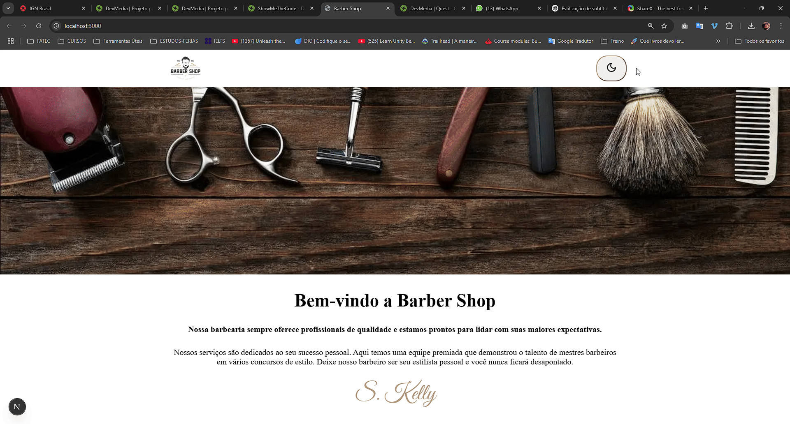

# Landing Page de Barbearia

Este projeto é uma landing page para uma barbearia, desenvolvida com React e utilizando o hook `useState` para gerenciar o estado da aplicação (MODO ESCURO).

## Como rodar o projeto

1. Clone o repositório:
   ```bash
   git clone https://github.com/seu-usuario/landingpage-barbearia.git



